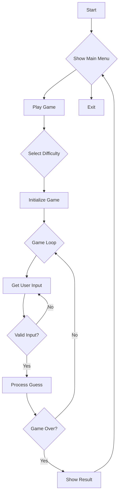

# 📈 Hangman Game Flowchart Documentation

## Overview
Create a detailed flowchart showing the logic flow of your Hangman game. Use standard flowchart symbols and include comprehensive decision paths.

## 🔄 Main Game Loop

## 📝 Required Elements

### 1. Game Initialization
- Program start
- Menu display
- Difficulty selection
- Word selection
- Score initialization

### 2. Input Processing
- User input collection
- Input validation
- Guess processing
- Score updating

### 3. Game State Updates
- Word display updates
- Score calculations
- Win/lose condition checks
- Hint system triggers

### 4. Game Termination
- Win condition
- Lose condition
- Play again option
- Program exit

## 🎯 Implementation Notes
- Use proper flowchart symbols
- Include all decision points
- Show loop structures
- Document error handling paths
- Include feature integration points

## 📚 Resources
- [Mermaid Flowchart Syntax](https://mermaid.js.org/syntax/flowchart.html)
- [Standard Flowchart Symbols](https://www.lucidchart.com/pages/flowchart-symbols-meaning-explained)
